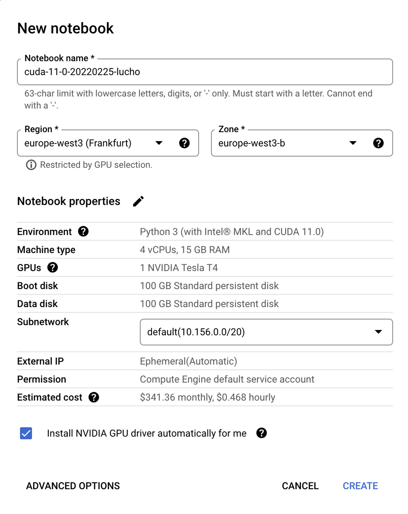

# This is a GCP repo for MLOps pipelines using feature store #

It's needed a GCP project on the Google Cloud Platform.
Login into: https://console.cloud.google.com/home/ 

These MLOps pipelines are using Kubeflow and Feature Store

The data used for this project is **public** and here is the link: 
https://www.kaggle.com/prajitdatta/movielens-100k-dataset 

### GCP services to be enabled/used:

1. Google Vertex AI
2. Notebooks API
3. Google Cloud Storage
4. Google Deployment Manager API

### Steps:

**Note:** Important to configure/install Google SDK previously and deploy all resources on same region (for example: europe-west3 - Frankfurt)

1. Deploy workbench Vertex AI

**Authors:**

* Lucho Farje
* Pawan Poojary

CapGemini Insights & Data
:sparkles: :rocket: :octocat: